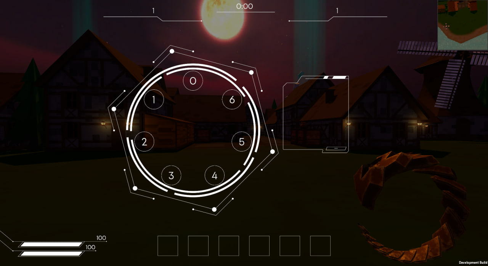
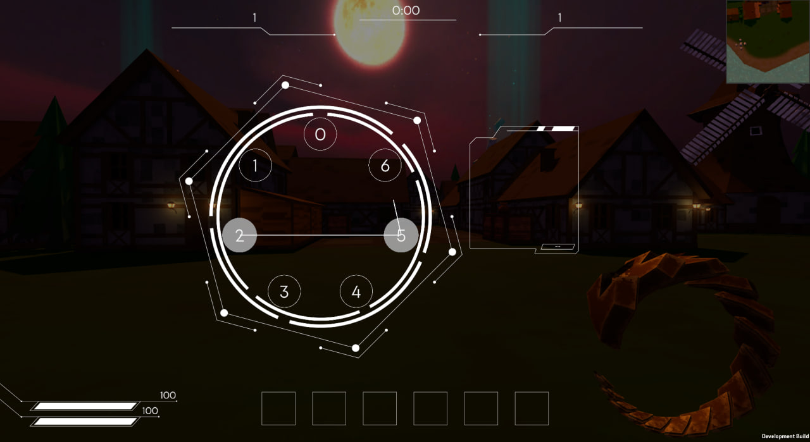
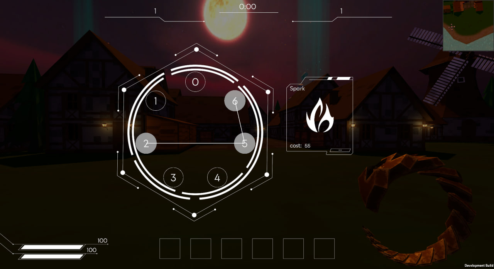

# ViciousSpiral Showcase

This repository contains selected C# systems from my multiplayer Unity prototype “Vicious Spiral”.
The focus is on clean architecture, UI-driven logic, and gameplay system design.

### What’s inside
- **Input-pattern recognition**
  Gesture drawing system based on connecting UI nodes. Includes pattern detection and spell matching.
- **Spell management**
  Runtime spell creation, charges, cooldowns, VFX attaching, and mana validation.
- **Spell slot UI**
  Dynamic slot generation, active slot switching, icons, and UI highlights.
- **Player state controller**
  Handles transitions between gameplay states (Normal, Casting, Menu, Dead).  
  Controls movement lock, camera behavior, and UI visibility.

### Technologies
- Unity (C#)
- Photon PUN (multiplayer)
- Event-driven UI logic
- Object-oriented architecture

This repository includes only selected logic pieces extracted and cleaned for clarity.

---

## 🔮 Spell Casting UI — Screenshots

### 1. Idle ring (before drawing)

### 2. Drawing a gesture

### 3. Recognized pattern with matched spell

### 4. Spell stored into slot

